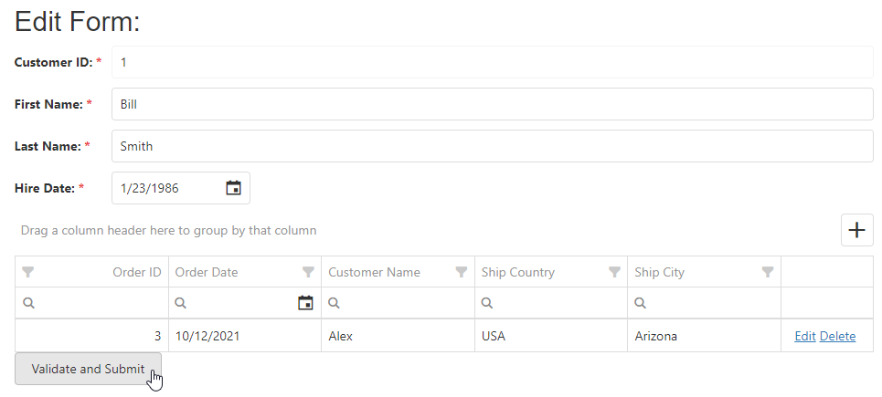

<!-- default badges list -->

<!-- default badges end -->
<!-- default file list -->
*Files to look at*:

<!-- default file list end -->
# DevExtreme Form - How to submit DataGrid model with form values

The HTML form can collect information from all hidden inputs and post it to the Controller. DataGrid initially does not have a hidden input. If you assign model values to the grid's [dataSource](https://js.devexpress.com/Documentation/ApiReference/UI_Components/dxDataGrid/Configuration/#dataSource) option, the model values are not passed to the server. 

This example shows how to create hidden inputs for each DataGrid row at runtime and place the hidden inputs onto the form. 

## Files to Look At

- [HomeController.cs](./MVC/dxSampleT590924/Controllers/HomeController.cs)
- [Order.cs](./MVC/dxSampleT590924/Models/Order.cs) 
- [Index.cshtml](./MVC/dxSampleT590924/Views/Home/Index.cshtml)
- [Success.cshtml](./MVC/dxSampleT590924/Views/Home/Success.cshtml)

## Documentation

- [Getting Started with Form](https://js.devexpress.com/Documentation/Guide/UI_Components/Form/Getting_Started_with_Form/)
- [Model Binding in ASP.NET Core](https://www.red-gate.com/simple-talk/dotnet/asp-net/model-binding-asp-net-core/)

## More Examples

- [Form - How to customize form items](https://github.com/DevExpress-Examples/Form-Custom-items)
